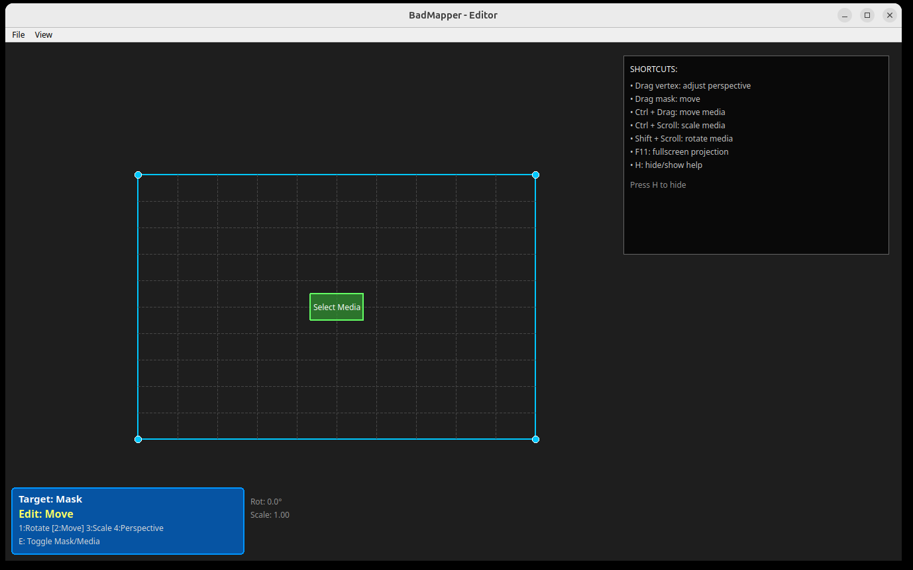

## BadMapper

[](https://github.com/manoelpiovesan/badmapper/actions/workflows/build.yml)

A simple projection mapping software, similar to MadMapper, but a free and open-source alternative — and unapologetically worse.


### Downloads

Download the latest release for your platform from the [Releases](https://github.com/manoelpiovesan/badmapper/releases) page:
- **Linux**: `badmapper-linux`
- **Windows**: `badmapper-windows.exe`


### Getting Started

Running venv

```bash
python3 -m venv venv
source venv/bin/activate
pip install -r requirements.txt
```

Running the app

```bash
python main.py
```


### Controls

| Key | Action |
|-----|--------|
| **1** | Rotate mode |
| **2** | Move mode |
| **3** | Scale mode |
| **4** | Perspective mode |
| **E** | Toggle Mask/Media editing |
| **H** | Show/Hide help |
| **F11** | Toggle fullscreen projection |


### Screenshots

