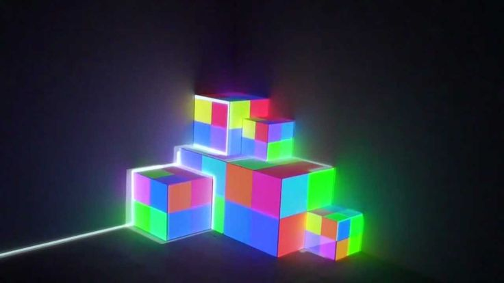

## BadMapper
[](https://github.com/manoelpiovesan/badmapper/actions/workflows/build.yml) 
[](https://github.com/manoelpiovesan/badmapper/releases/latest)
[](https://github.com/manoelpiovesan/badmapper/releases)
[](https://github.com/manoelpiovesan/badmapper/releases/latest)

[](https://ko-fi.com/L3L61SRB88)

A simple projection mapping software, similar to MadMapper, but a free and open-source alternative — and unapologetically worse.



Exemple of use case. Source: [Pinterest](https://i.pinimg.com/736x/84/96/ee/8496eead7424f1642b5c1eeba7f73ad3.jpg)

## Downloads

Download the latest release for your platform from the [Releases](https://github.com/manoelpiovesan/badmapper/releases) page:
- **Linux**: `badmapper-linux`
- **Windows**: `badmapper-windows.exe`


## Getting Started

Running as development mode

Create a virtual environment and install dependencies
```bash
python3 -m venv venv
source venv/bin/activate
pip install -r requirements.txt
```

Running the app
```bash
python main.py
```

### Controls
Press H to show/hide helper panel.

## Features

### OpenGL Hardware Acceleration
BadMapper uses **OpenGL for GPU-accelerated rendering**, providing:
- **60 FPS** projection output (vs 30 FPS CPU-based)
- **Real-time video processing** with minimal latency
- **Efficient texture management** for multiple masks
- **Hardware-accelerated transformations** (scale, rotate, perspective)
- **Fallback to CPU rendering** if OpenGL is unavailable

**Keyboard Shortcuts:**
- `O` - Toggle between OpenGL and CPU rendering (in projection window)
- `G` - Toggle grid overlay

### Project Files (.bad)
BadMapper allows you to save and load projects in `.bad` format (JSON-based). Projects include:
- Mask positions, types, and transformations
- Media file paths (images and videos)
- Webcam configurations
- Media transformations (position, scale, rotation, perspective)
- Projection settings (width and height)

**Keyboard Shortcuts:**
- `Ctrl+N` - New Project
- `Ctrl+O` - Open Project
- `Ctrl+S` - Save Project
- `Ctrl+Shift+S` - Save Project As

### Webcam Support
BadMapper supports using webcams as live media sources for your masks:
1. Select a mask
2. Go to `File > Add Webcam to Mask`
3. Choose the webcam index (usually 0 for the default camera)
4. The webcam feed will be displayed in real-time on your projection

**Note:** Webcam configurations are saved in project files and will automatically reconnect when you load the project.

## Screenshots


